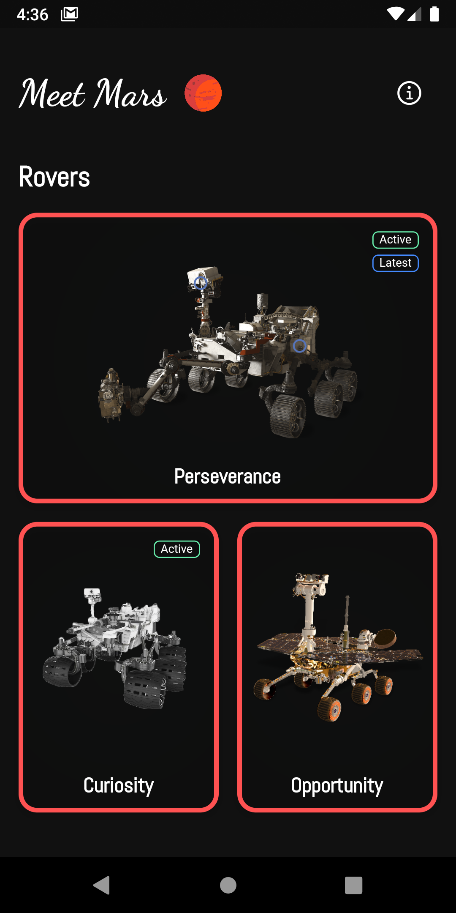
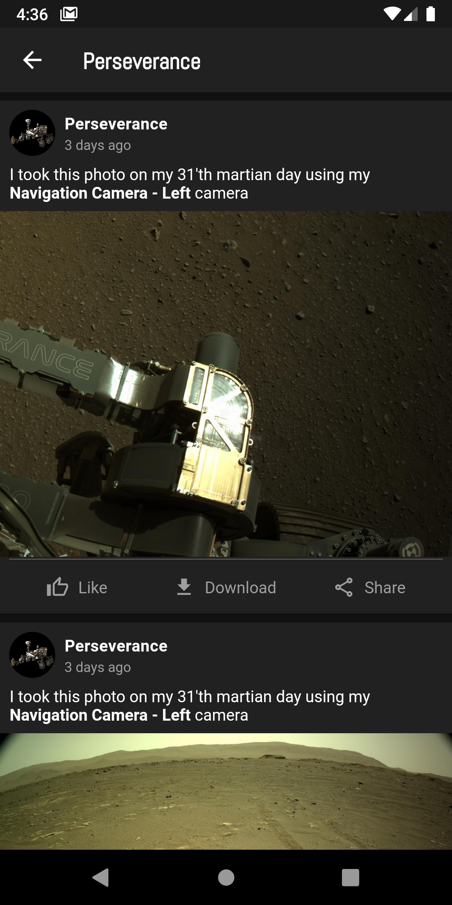
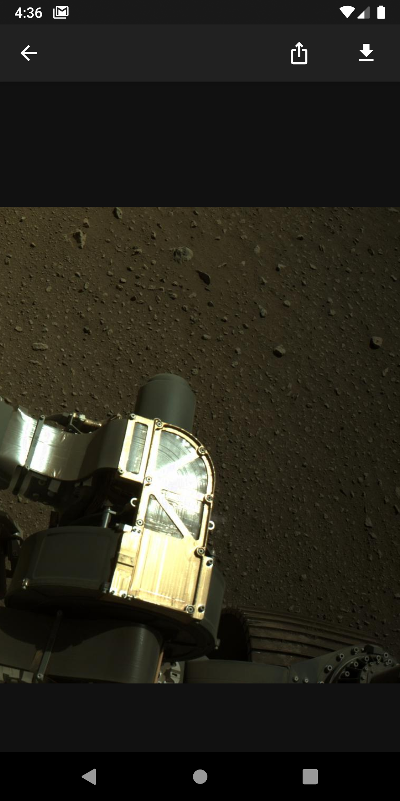
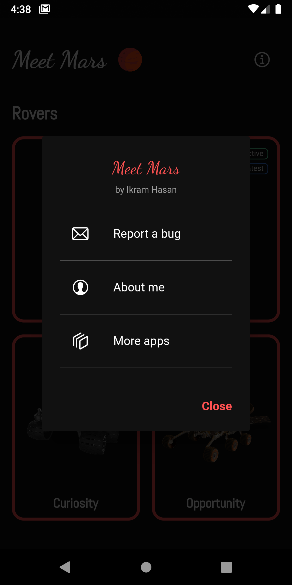

# Meet Mars

| Home Screen | Post Screen |
| :-----------: | :---------------------: | 
|  |  | 

| View Image Screen | About Screen |
| :-----------: | :---------------------: | 
|  |  | 

## Description
This app let's you see the photos taken by the rovers on mars as soon as we get them. It lists the photos in a facebook like post format (as if the rovers were making the post). You can also download and share the photos. Made using flutter, dart and the [Nasa](https://api.nasa.gov/) api

## Demo
Download the fat android apk from [Google Drive](https://drive.google.com/drive/folders/1XMCSvE3TZFva1e5burbElxJOjOf97In0?usp=sharing)

(Website in development)

## Features

- [x] See the photos taken by the rovers
- [x] Download the photos
- [x] Share the photos
- [ ] See mars weather
- [ ] Build the site
   
## My Socials

 
 

  &nbsp &nbsp &nbsp

## License

    BSD Zero Clause License

    Copyright © 2021 ikramhasan

    Permission to use, copy, modify, and/or distribute this software for any
    purpose with or without fee is hereby granted.

    THE SOFTWARE IS PROVIDED "AS IS" AND THE AUTHOR DISCLAIMS ALL WARRANTIES WITH
    REGARD TO THIS SOFTWARE INCLUDING ALL IMPLIED WARRANTIES OF MERCHANTABILITY
    AND FITNESS. IN NO EVENT SHALL THE AUTHOR BE LIABLE FOR ANY SPECIAL, DIRECT,
    INDIRECT, OR CONSEQUENTIAL DAMAGES OR ANY DAMAGES WHATSOEVER RESULTING FROM
    LOSS OF USE, DATA OR PROFITS, WHETHER IN AN ACTION OF CONTRACT, NEGLIGENCE OR
    OTHER TORTIOUS ACTION, ARISING OUT OF OR IN CONNECTION WITH THE USE OR
    PERFORMANCE OF THIS SOFTWARE.
